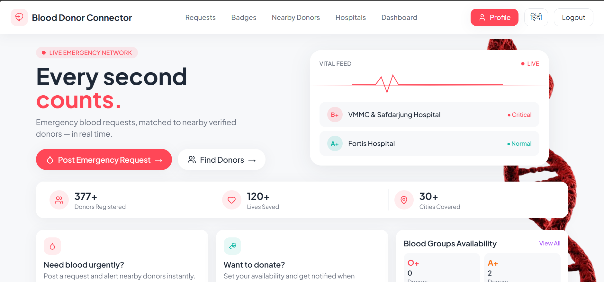
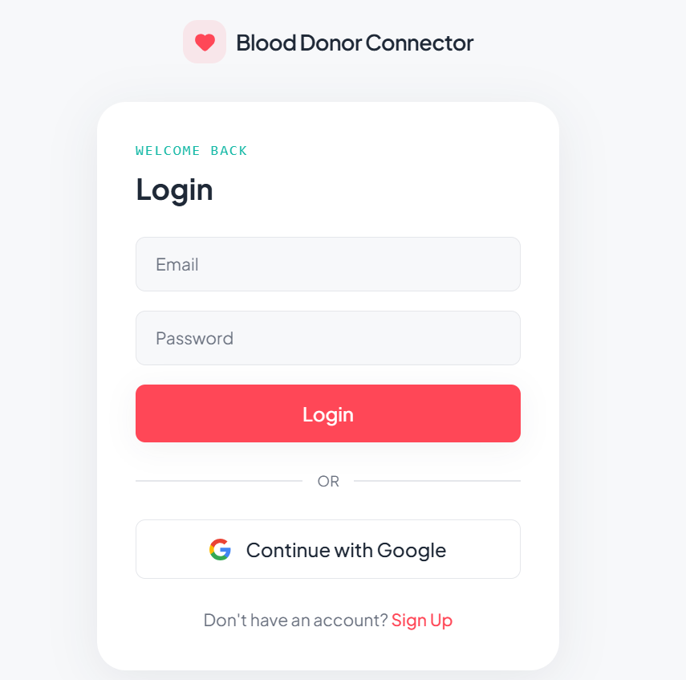
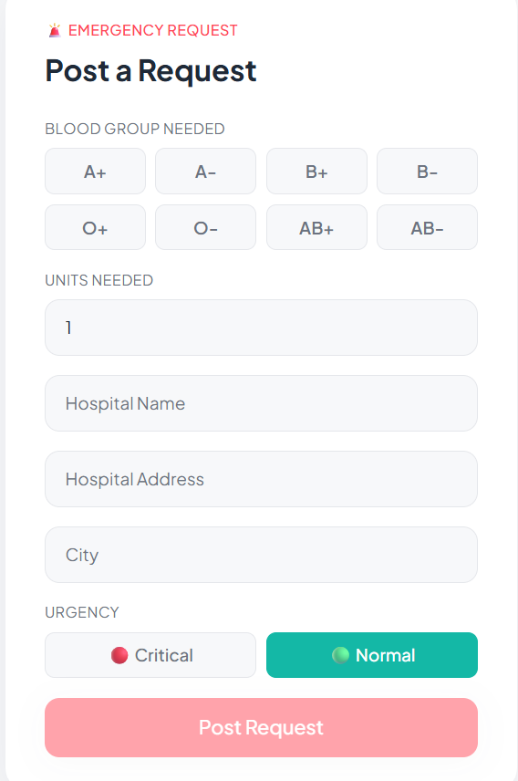
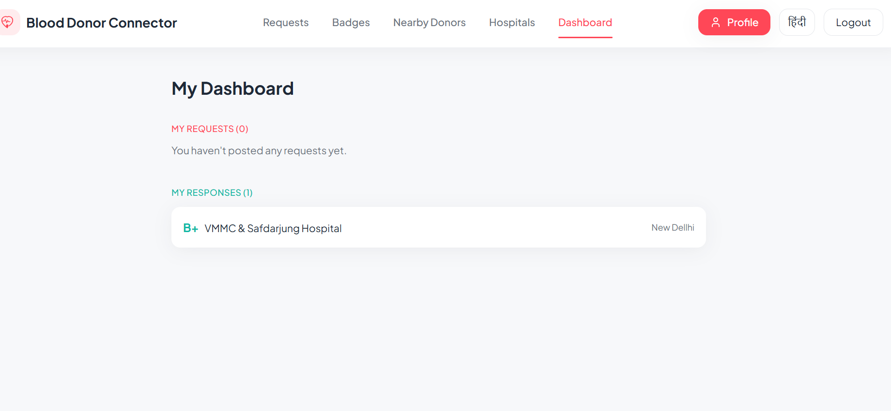
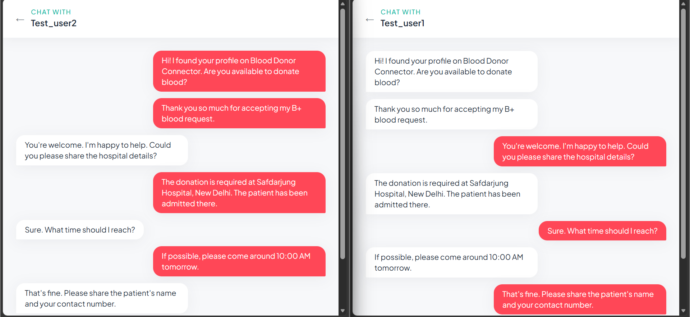
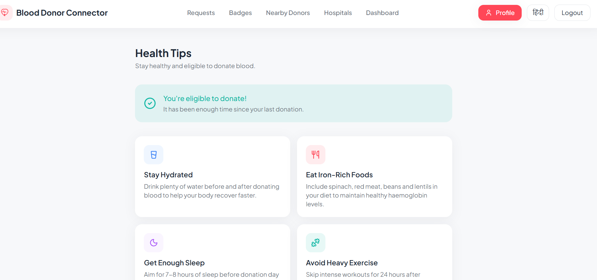

# Blood Donor Connector 🩸

A real-time blood donation platform connecting emergency blood requesters with nearby verified donors.

## Features

- 🔐 Authentication with Supabase Auth
- 📍 Location-based nearest donor & hospital finder (Leaflet + OpenStreetMap)
- 💬 Real-time chat between donors and requesters
- 🔔 Real-time notifications for new requests and donor responses
- 🏆 Badge/rewards system based on donation history
- 🌐 Multi-language support (English/Hindi)
- 🌗 Dark/Light mode
- 📊 Dashboard with request and donation tracking
- 🏥 Nearby hospitals via Overpass API

## Tech Stack

- **Frontend:** React (Vite), Tailwind CSS, Framer Motion
- **Backend:** Supabase (PostgreSQL, Auth, Realtime, Storage)
- **Maps:** Leaflet, OpenStreetMap, Overpass API
- **Icons:** Lucide React

## Getting Started

1. Clone the repo
```bash
   git clone https://github.com/Kaushal-98/blood-donor-app.git
   cd blood-donor-app
```

2. Install dependencies
```bash
   npm install
```

3. Create a `.env` file in the root with your Supabase credentials:


4. Run the development server
```bash
   npm run dev
```

## 🌐 Live Demo

🔗 [View Live Demo](https://blood-donor-connector.vercel.app)

## Screenshots


### 🏠 Home Page



### 🔐 Login Page



### 🩸 Blood Request Page



### 🩸 Donor Dashboard



### 💬 Real-Time Chat



### 👨🏻‍⚕️ Health Tips




## License

MIT